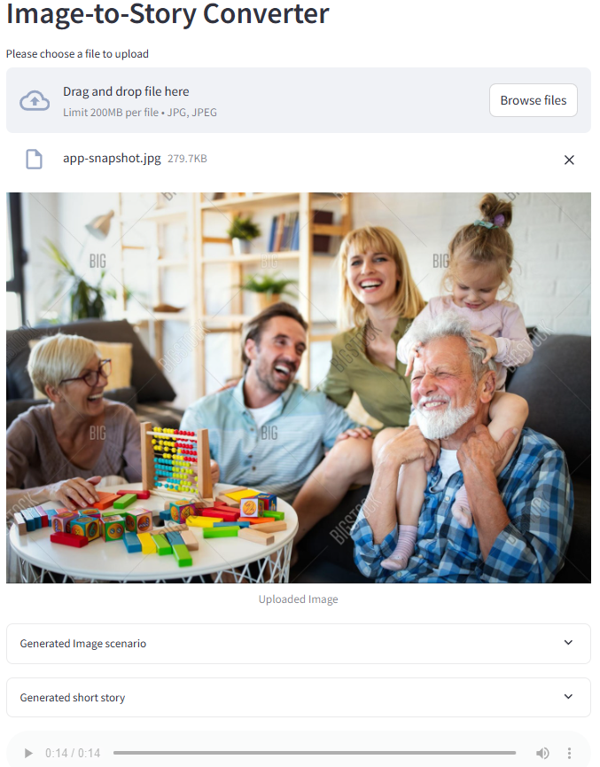
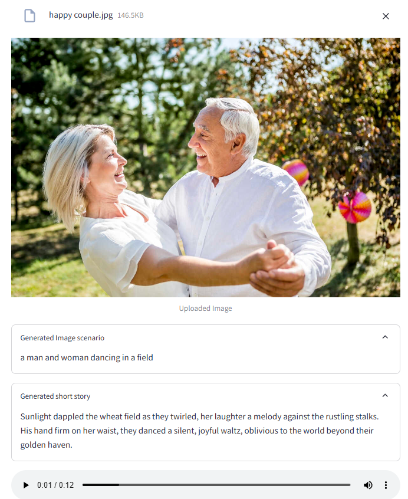

# 🖼️ Image-to-Story Converter

A Streamlit application that converts images into short stories with audio narration using AI models.

## 🔄 System Design


The application follows a pipeline architecture where:
1. Image file is processed by BLIP model for text description
2. Text description is transformed into a story using Gemini Pro
3. Story is converted to speech using ChatTTS
4. Final audio file is generated for playback

## 📱 Application Interface



Example Output:


## 🌟 Features

- Image to text conversion using BLIP model
- Story generation using Gemini Pro
- Text-to-speech synthesis using ChatTTS
- Interactive web interface with Streamlit

## 🛠️ Installation

1. Clone the repository

```bash
git clone https://github.com/BlakeAmory/image_to_story_converter.git
cd image_to_story_converter
```

2. Install dependencies

```bash
pip install -r requirements.txt
```

3. Set up environment variables by creating a `.env` file:

```bash
HUGGINGFACE_API_TOKEN="your_huggingface_api_token"
GEMINI_API_KEY="your_gemini_api_key"
```

## 🚀 Usage

1. Start the Streamlit application:

```bash
streamlit run app.py
```

2. Open your browser and navigate to `http://localhost:8501`

3. Upload an image (JPG format)

4. The application will:
   - Generate a description of your image using BLIP
   - Create a 50-word story based on the description using Gemini Pro
   - Convert the story to speech using ChatTTS
   - Display both the description and story in expandable sections
   - Play the generated audio narration

## 💻 Technical Details

The application uses three main AI components:

- **BLIP Model**: Salesforce's BLIP image captioning model for generating image descriptions
- **Gemini Pro**: Google's language model for creative story generation (version 1.5-pro-002)
- **ChatTTS**: Text-to-speech synthesis for audio narration

Additional technical features:
- Progress bar visualization during processing
- Streamlit-based responsive UI
- Custom CSS styling for better user experience

## 📁 Project Structure

image-to-story-converter/
├── app.py # Main application file
├── requirements.txt # Project dependencies
├── .env # Environment variables (create this)
├── utils/
│ └── custom.py # Custom CSS and utilities
└── docs/

## ⚠️ Notes

- Ensure you have valid API keys for both Hugging Face and Gemini Pro
- The application only accepts JPG images
- Initial model loading might take some time
- Generated stories are limited to 50 words for conciseness

## 📄 License

This project is licensed under the MIT License - see the [LICENSE](LICENSE) file for details.